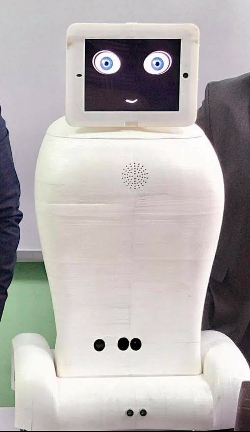
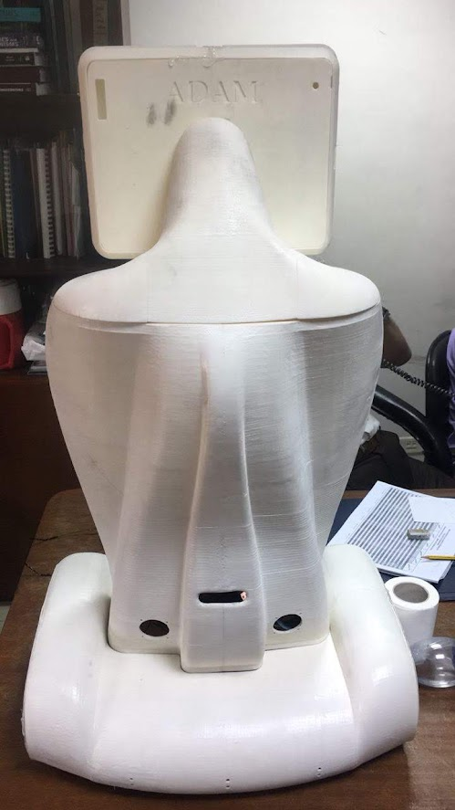
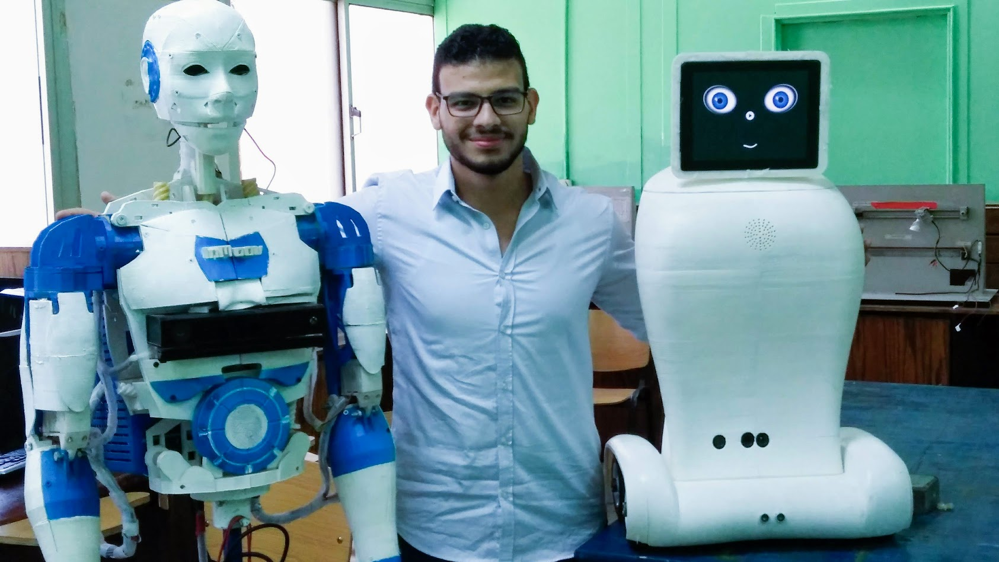

# Adam-Social-interactive-robot-capable-of-autonomous-navigation-and-human-interaction
## My Bachelor's Graduation Project: Social interactive robot capable of autonomous navigation and human interaction

- The best graduation project in Mechatronics department (2018).
- ADAM is Social interactive robot capable of autonomous navigation and human interaction throwmultiple of advanced feature implemented.
- Implemented human interaction features such as Facial recognition, identify the new humans andask about their names and make a real time training to recognize them in the future using deeplearning algorithm.
- Other features such as chat-bot,  follow me using PID control,  Capability to connect as a nodewith IoT System, remotely control and visualization throw web page.
- SLAM algorithm for navigation using kinetic sensor, ultrasonic and mono-camera.•Using Robot operating system (ROS) architecture to integrate all the features

